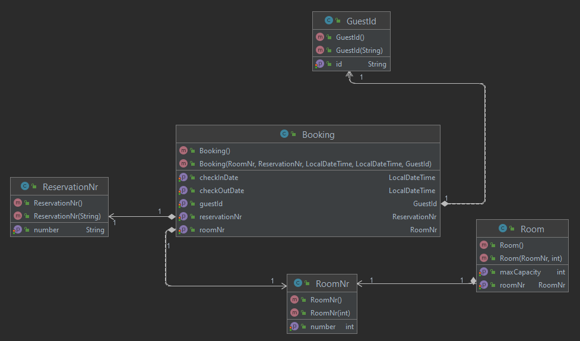
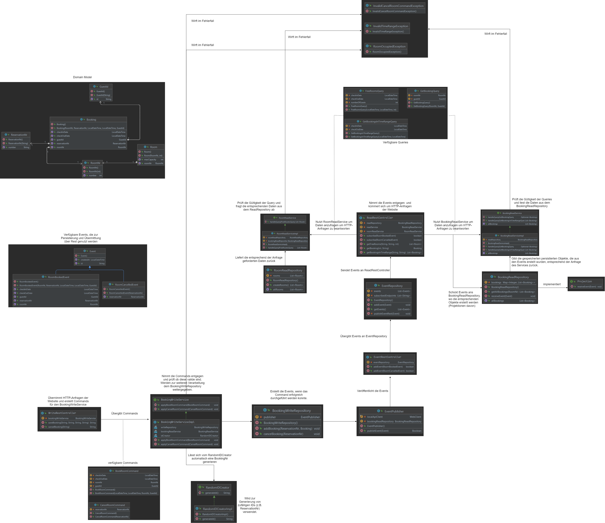

# Systemarchitectures_Lab1
CQRS und Event Sourcing Projekt für den Kurs Systemarchitekturen an der FH
Vorarlberg.

## Allgemeine Struktur
Das Projekt besteht aus insgesamt drei Spring Boot Applikationen, die
jeweils auf einem eigenen Port laufen. Die Applikationen wurden jeweils
in einem eigenen Ordner zusammengefasst und haben alle ein eigenes Main.

- EventSide (Port 8080)
- WriteSide (Port 8081)
- ReadSide (Port 8082)

In folgender Abbildung wird das Domain Model der Applikation gezeigt. Darin
ist ersichtlich, dass die GuestId, ReservationNr und RoomNr als Value Objects
implementiert wurden. Diese Designentscheidung ergab sich, weil dadurch die Anzahl der
notwendigen Übergabeparameter für die Methoden minimiert werden können.

Folgende Abbildung soll die Kommunikation zwischen den Klassen bzw. Applikationen
verdeutlichen.

Ein erfolgreich durchgeführtes Command führt zu einem passenden Event. Die
ReadSide erhält über eine Rest-Schnittstelle das Event und baut sich darauf
aufbauend ein entsprechendes Objekt (z.B. Buchung) als Projektion auf. So wird
das ReadModel aufgebaut. Diese Vorgehensweise ermöglicht es, dass die WriteSide
lediglich die Events an die EventSide weiterleiten muss, welche auch nur die Events
speichert. Die Objekte aus dem Domain Model selbst werden nur von der ReadSide
benötigt.

## Verwendung
Als erstes muss die EventSide gestartet werden. Als Nächstes wird die 
ReadSide gestartet, die WriteSide muss die letzte Applikation sein, die
gestartet wird, da diese sowohl von der EventSide als auch von der ReadSide
abhängig ist.

Mittels Commandozeile können die Applikationen wie folgt gestartet werden:
- EventSide: java -jar eventSide.jar
- ReadSide: java -jar readSide.jar
- WriteSide: java -jar writeSide.jar

Der Startpunkt der Applikation befindet sich im Browser unter localhost:8080. Dort
ist auch ersichtlich, wo die Commands und Queries ausgeführt werden können.

- Commands: localhost:8081/html/command.html
- Queries: localhost:8082/html/query.html

#### Unterstützte Commands:

- BookRoomCommand (mit checkInDate, checkOutDate, roomNr, guestId), führt zu RoomBookedEvent
- CancelRoomCommand (mit reservationNr), führt zu RoomCancelledEvent

#### Unterstützte Queries:

- FreeRoomsQuery (mit checkInDate, checkOutDate, numberOfGuests)
- GetBookingQuery (mit roomNr, guestId)
- GetBookingsInTimeRange (mit checkInDate, checkOutDate)

## Kommunikation zwischen den Applikationen
WriteSide: Über den EventPublisher werden die Events an den Rest Controller der EventSide 
übertragen.

EventSide: Im EventRepository werden die Subscriber gespeichert und 
über den ReadRestController benachrichtigt, wenn ein neues Event hinzugefügt wurde.

## Testfälle
Im Folgenden werden die durchgeführten Testfälle kurz beschrieben und
dokumentiert, wie das zu erwartende Ergebnis ist.

#### Commands
- Gültige Buchung erstellen
  - RoomBookedEvent wurde erstellt
- Buchung mit CheckInDate in der Vergangenheit 
  - Wirf InvalidTimeRangeException
- Buchung mit CheckInDate nach CheckOutDate
  - Wirft InvalidTimeRangeException
- Buchung mit Raum erstellen, der zur gewünschten Zeit bereits belegt ist
  - Wirft RoomOccupiedException
- Buchung der Vergangenheit erstellen und versuchen, diese zu canceln
  - wirft InvalidCancelRoomCommandException
- Buchung canceln (um Buchung zu canceln GetBookingQuery oder GetBookingsInTimeRangeQuery ausführen um Reservation Number zu erhalten)
  - RoomCancelledEvent wurde erstellt
- Falsche Reservierungsnummer
    - InvalidReservationNrException

#### Queries
- FreeRoomsQuery:
  - Gültigen Zeitraum eingeben
    - z.B. Such-Zeitraum von 01.02.2022 - 07.02.2022 für 2 Personen -> Nummer 1,2,5,6,7,8,14,15,17 und 19 sind frei
  - CheckInDate nach CheckOutDate
    - InvalidTimeRangeException
- GetBookingQuery:
  - Buchung suchen, die es gibt
    - Entsprechende Buchung wird zurückgeliefert
  - Buchung suchen, bei welcher jeweils GuestId oder RoomNr nicht stimmt
    - "No booking found"/Optional.empty
- GetBookingsInTimeRangeQuery:
  - Gültigen Zeitraum eingeben 
    - Buchungen für diesen Zeitraum werden zurückgeliefert
  - Ungültigen Zeitraum eingeben (z.B. CheckOutDate vor CheckInDate)
    - "No bookings found"/Empty list wird zurückgeliefert

